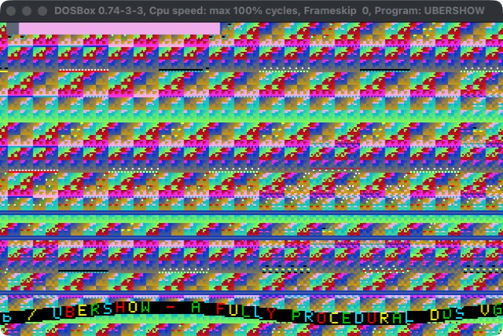

# UBER256 / UBERSHOW — a zero-asset DOS VGA demoscene project



Two flat real-mode DOS `.COM` programs, hand-written in NASM assembly, that run on
DOSBox or real VGA-compatible DOS hardware. There are no image files, no fonts loaded
from disk, no music samples, no libraries, and no protected-mode extender — every pixel,
glyph, note and 3D vertex is generated procedurally by the code itself.

| File | Purpose | Size | CPU | Video |
|---|---|---|---|---|
| `intro256.asm` | strict ≤256-byte sizecoded intro | 70 bytes | 386+ | VGA mode 13h |
| `showcase.asm` | full multi-scene production demo | ~3.6 KB | 386+ | VGA mode 13h |

## Quick start

```sh
./build.sh        # assemble both .COM files with NASM, run the audits
./run-dosbox.sh   # run UBERSHOW.COM in DOSBox (pass UBER256.COM for the intro)
```

Press **Esc** to exit cleanly back to DOS. Requires [NASM](https://www.nasm.us/) and
[DOSBox](https://www.dosbox.com/) on your `PATH` (on macOS, `brew install nasm` and
`brew install --cask dosbox` — the launcher also finds `dosbox.app` automatically if
it isn't symlinked onto `PATH`).

## `UBERSHOW.COM` — the showcase

A single continuous demo, driven by one 16-bit frame counter that never resets, so
visuals, palette, music and overlays all stay phase-locked to each other.

**17 scenes**, ~7.3 real seconds each at the emulated monitor's 70 Hz, grouped into
four conceptual acts:

| # | Scene | Technique |
|---|---|---|
| 1 | Interference plasma | affine X/Y waves folded through XOR |
| 2 | Radial tunnel | squared centered coordinates, no perspective divide |
| 3 | XOR multiplier field | `x*y` dense nonlinear lattice |
| 4 | Concentric moire | squared radial distance rings |
| 5 | Zooming checker grid | no multiply in the inner loop |
| 6 | Dual-source ripples | Manhattan-distance interference |
| 7 | Twisting vertical ribbons | per-scanline phase shift |
| 8 | Cellular/feedback field | deterministic, no prior-frame dependency |
| 9 | Copper-wave bands | cheap scanline recurrence |
| 10 | Expanding diamond rings | Manhattan distance, no multiply |
| 11 | Animated lattice | diagonal XOR interference |
| 12 | Horizontal warp bands | sign-extended phase offset |
| 13 | Scanwave / CRT bands | odd/even scanline shift |
| 14 | Bitplane interference | AND-masked digital look |
| 15 | Vortex mixer | signed-coordinate XOR, no division |
| 16 | **Rotating wireframe cube** | real 3D: see below |
| 17 | Finale | combines time, coordinates and radial energy |

Scenes 1–15 and 17 are full-screen procedural fields: a `STOSB` loop touches all
64,000 pixels every frame from cheap integer recurrences (XOR, shifts, the
occasional `IMUL`) — no lookup tables, no asset data. Scene 16 is architecturally
different (see below) and is the only one that doesn't fit that renderer contract.

On top of every scene:
- **Three soft-glow raster bars**, phase-locked to the frame clock, each a
  dim/bright/dim triple scanline rather than one flat line.
- **A 17-block scene-progress marker** in the top-left corner.
- **A palette-domain fade** in/out around every scene boundary (hides the hard cut).
- **A symmetric shutter transition** (black bars closing/opening) layered on top.
- **A colour-cycling sine-wave text scroller** along the bottom (see below).

### Rotating 3D wireframe cube (scene 16)

The one non-procedural-field scene: it clears the backbuffer to a flat colour, then
does real 3D — two-axis rotation (Y then X) of 8 vertices using a shared 256-entry
sine table (`cos(a) = sin(a+64)`, a quarter-turn lookup, so one table serves both),
a **true perspective projection** (divide by distance from the eye, not orthographic
— nearer faces are visibly larger), and draws the 12 edges with a from-scratch
Bresenham line routine. Edges are depth-cued: the two nearer edges per face render
bright white, the two farther ones dim grey, for basic hidden-depth cueing without
real hidden-line removal. All of it — rotation, projection, line draw — is 16-bit
fixed-point integer math; no FPU, no floating point.

### Sine-wave text scroller

A from-scratch 5×7 bitmap font (29 glyphs: the letters/digits/punctuation the
scroller message actually uses) rendered column-by-column along the bottom 8
scanlines, with each column's vertical position offset by the same sine table the
cube uses, for the classic wavy-scroller look. The foreground colour cycles through
a small fixed rainbow (red/yellow/green/cyan) both along the message and over time,
so it doesn't just sit as flat white. Two DAC indices are reserved as fixed pure
black/white (and four more for the rainbow) so the scroller and cube stay legible
regardless of what the main per-scene palette animation is doing elsewhere — see
"Fixed vs. animated palette" below.

### Music

A 16-step A-minor-pentatonic arpeggio on the PC speaker (PIT channel 2), with real
rests (not just a continuous drone) and a short staccato mute before each retrigger
for a clean note attack. Transposition across the show's three acts is done by
**halving the PIT divisor** (exactly one octave per step) rather than a raw
arithmetic offset, so every transposed note stays in tune regardless of its
starting pitch.

### Fixed vs. animated palette

`palette_tick` drives one continuous animated formula across all 256 DAC entries
every frame — which looks great for the procedural fields, but means no single
index is guaranteed to stay a consistent colour from frame to frame. The scroller
and cube need reliable contrast, so DAC indices **1–7 are reserved** immediately
after the main animated loop runs each frame, overriding whatever it assigned them:
1=black, 2=white, 3=dim grey (cube depth cue), 4–7=a small fixed rainbow (scroller).

## `UBER256.COM` — the strict intro

A classic sizecoded 256-byte intro: almost the entire program is one pixel
recurrence (XOR, add, multiply, shift) over `X`, `Y` and a frame counter, written
directly with `STOSB` — no asset data, no clearing pass, BIOS/DOS used only for mode
entry/exit. Coordinates double as loop counters; register reuse and arithmetic
overflow are the texture generator, not bugs. Comes in at 70 bytes, with the
remaining ~186 bytes of the 256-byte budget unused.

## Hardware model

BIOS `INT 10h` AX=0013h selects 320×200, 256-colour VGA (mode 13h): one byte per
pixel, a 64,000-byte framebuffer at `A000:0000`. Since 64,000 < 65,536, the whole
frame fits in one real-mode segment and a linear `STOSB` can traverse it without
bank switching — `offset = y*320 + x`, and a full-frame renderer doesn't even need
the multiply if it just starts `DI=0` and does 64,000 sequential stores.

The showcase programs the VGA DAC through ports `3C8h`/`3C9h` (six-bit R/G/B per
entry), polls port `3DAh` bit 3 for vertical retrace as a frame-pacing boundary, and
reads the 8042 keyboard controller directly (status port `64h`, data port `60h`) for
Esc — with IRQ1 masked at the 8259 PIC for the program's duration, since otherwise
the BIOS's own interrupt handler races the direct port poll and wins almost every
time (see "Known issues this audit found and fixed" below). PC speaker output goes
through port `61h` (gate) and PIT channel 2 (ports `42h`/`43h`).

### A DOS `.COM` memory-model gotcha

A `.COM` program owns *all* free conventional memory at launch by default (its PSP
block spans to the top of the DOS arena). `UBERSHOW.COM` needs a 64,000-byte
backbuffer, allocated via `INT 21h AH=48h` — which will always fail with
"insufficient memory" unless the program first **shrinks its own memory block**
(`AH=4Ah`, SETBLOCK) to free some up. `start:` does this immediately, before
anything else, and switches onto a small local stack inside the block it keeps.

## Timing: vsync pacing vs. DOSBox's `cycles` setting

The showcase paces itself correctly in software regardless of host speed: every
frame polls the real VGA retrace bit via `wait_vsync` before presenting, capping
display rate at the emulated monitor's ~70 Hz. `DOSBOX.CONF` ships with
`cycles=max` / `core=auto` — this does **not** defeat that pacing; it just lets the
CPU render each frame's effect as fast as the host allows and then wait at the
retrace poll, same as the host-fast-forward-then-wait behavior of any other DOSBox
program. A fixed lower cycle count only risks the renderer not finishing before the
next retrace (visibly stuttery), for no benefit — and in testing, a mid-range fixed
value was observed getting silently throttled further by DOSBox's own
auto-adjustment under host load anyway.

`run-dosbox.sh` builds a temporary conf from `DOSBOX.CONF` with the actual
mount/run commands folded into its own `[autoexec]` section before launching with
`-conf` alone: combining `-conf` with separate command-line `-c` autoexec flags was
found (in this testing) to silently cap `cycles=max` at a low fixed value instead of
running full speed, so the launcher avoids that combination entirely.

## Source audits

Three layered static checks, run as part of `./build.sh`:

- **`audit.py`** — structural sanity: COM origin/mode declarations, VGA entry,
  framebuffer usage, rejects accidental x86-64-only register names (`sil`/`dil`/
  etc., illegal in 16-bit real mode — this class of bug did slip through once, see
  below).
- **`audit_final.py`** — per-scene invariants: all 17 scenes present, each one
  either does a full 320×200 `STOSB` sweep ending in `jmp overlay`, or (for
  `scene_cube`) clears via `rep stosw` and calls `draw_line`; checks the DAC/input/
  cleanup invariants and that every scene actually hands off to `overlay` instead of
  falling through into the next one.
- **`release_audit.py`** — whole-tree release gate: every file present, every scene
  label appears exactly once, memory/VGA/palette/input/audio invariants, the strict
  256-byte build gate.

These catch structural regressions fast, but **they are not a substitute for an
actual build-and-run pass** — see below for what a real assemble-and-run turned up
that pure static/text-level checks could not.

## Files

- `intro256.asm` — strict sizecoded intro source
- `showcase.asm` — full showcase source (scenes, scroller, cube, music, palette)
- `audit.py`, `audit_final.py`, `release_audit.py` — layered static source audits
- `build.sh` — reproducible NASM build, audit run, and 256-byte gate enforcement
- `run-dosbox.sh` — DOSBox launcher (showcase by default, `UBER256.COM` as `$1`)
- `DOSBOX.CONF` — DOSBox configuration (vsync-correct `cycles=max`/`core=auto`)
- `MANIFEST.sha256` — SHA-256 hashes of every source file
- `TECHNICAL.md` — low-level implementation notes (COM loading, DAC, retrace, …)
- `FINAL_REVIEW.md` — design/architecture review
- `screenshot.jpg` — `UBERSHOW.COM` running live in DOSBox

## Known issues this audit found and fixed

This project was originally packaged in an environment with **no NASM or DOSBox
available**, so it had never actually been assembled or run before this audit. A
real build-and-run pass (installing both tools and testing live in DOSBox) found
several bugs the static/text-grep audits could not catch on their own:

- **`showcase.asm` didn't assemble at all**: `scene_tunnel` used `add al,si`, which
  is illegal in 16-bit real mode (SI has no addressable low byte, unlike AX/BX/CX/
  DX). Fixed by routing the value through BX.
- **Memory corruption**: `scene_feedback` was missing its `jmp overlay`, so it fell
  through into `scene_copper`'s renderer with `DI` already past the end of the
  64,000-byte backbuffer — wrapping the segment offset and overrunning the
  DOS-allocated block. Fixed, and `audit_final.py` now checks every scene for a
  terminating jump so this can't pass silently again.
- **`UBERSHOW.COM` could never actually run**: it always printed "not enough
  conventional memory" and exited immediately, confirmed live in DOSBox. Root
  cause and fix described above under "A DOS `.COM` memory-model gotcha".
- **Esc was effectively non-functional**: direct 8042 port polling for the
  keyboard raced the BIOS's own IRQ1 handler (which almost always won), with no
  guard in `intro256.asm` at all and an incomplete one in `showcase.asm`. Fixed in
  both by masking IRQ1 at the 8259 PIC for the program's duration.
- **`build.sh`/`run-dosbox.sh` shipped without the executable bit**, so the
  documented commands failed outright.
- **The scroller/cube lost contrast** against the main per-scene animated palette
  (both used plain DAC indices that the animation loop also wrote every frame, so
  foreground/background could converge to similar tones). Fixed by reserving fixed
  DAC entries, as described above.
- **`run-dosbox.sh` silently ran at throttled speed**: combining `-conf` with
  separate `-c` autoexec flags capped DOSBox at a low fixed cycle count instead of
  `cycles=max`. Fixed by folding the autoexec into the conf file itself.
- Several documentation inaccuracies (a mis-described memory-allocation size, a
  stale pixel-store comment) were also corrected.

All three audit scripts and a full `./build.sh` pass; both `.COM` files have been
built with real NASM and run live in DOSBox, confirmed rendering, animating, and
exiting cleanly on Esc.
